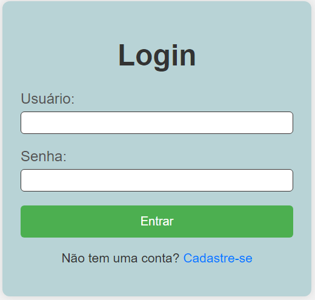

# Estrutura do Manual do Usuário

# Manual do Usuário

## 1. Introdução
Bem-vindo ao Sistema de Cadastro e Login! Este sistema permite que os usuários se registrem e façam login de forma segura. A seguir, você encontrará instruções detalhadas sobre como utilizar o sistema.

## 2. Cadastro de Usuários
1. Acesse a página de cadastro.
2. Preencha os campos obrigatórios: Nome de usuário, E-mail, Senha.
3. Clique em "Registrar".
4. Você verá uma mensagem de confirmação se o cadastro for bem-sucedido.
5. Exemplo de tela
6. 

## 3. Login
1. Acesse a página de login.
2. Insira seu nome de usuário e senha.
3. Clique em "Entrar".
4. Você será redirecionado para a página inicial se as credenciais estiverem corretas.
5. 

## 4. FAQ (Perguntas Frequntes)
**Posso alterar meu nome de e-mail?**
Atualmente, o sistema não permite alterações no nome de usuário. Para alterar o e-mail, entre em contato com o suporte.

## 5. Contato e Suporte
Para suporte, entre em contato pelo e-mail:suporte@exemplo.com ou ligue para (00)1234-5678
<<<<<<< HEAD

⌨️ com ❤️ por Danubia Alves 😊
=======
## Autora do manual e projeto Danubia Alves
>>>>>>> 5f5572086695f9c5d74d79f30adbbd61811e979a
